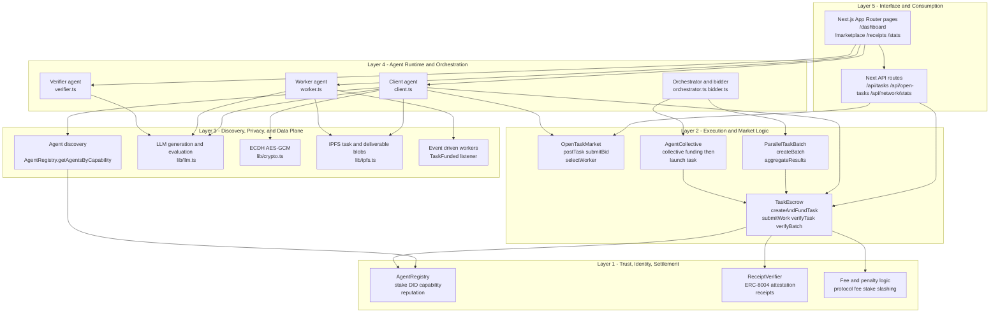
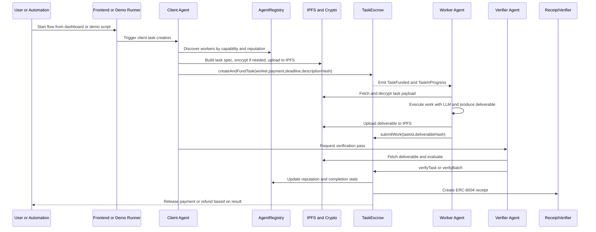
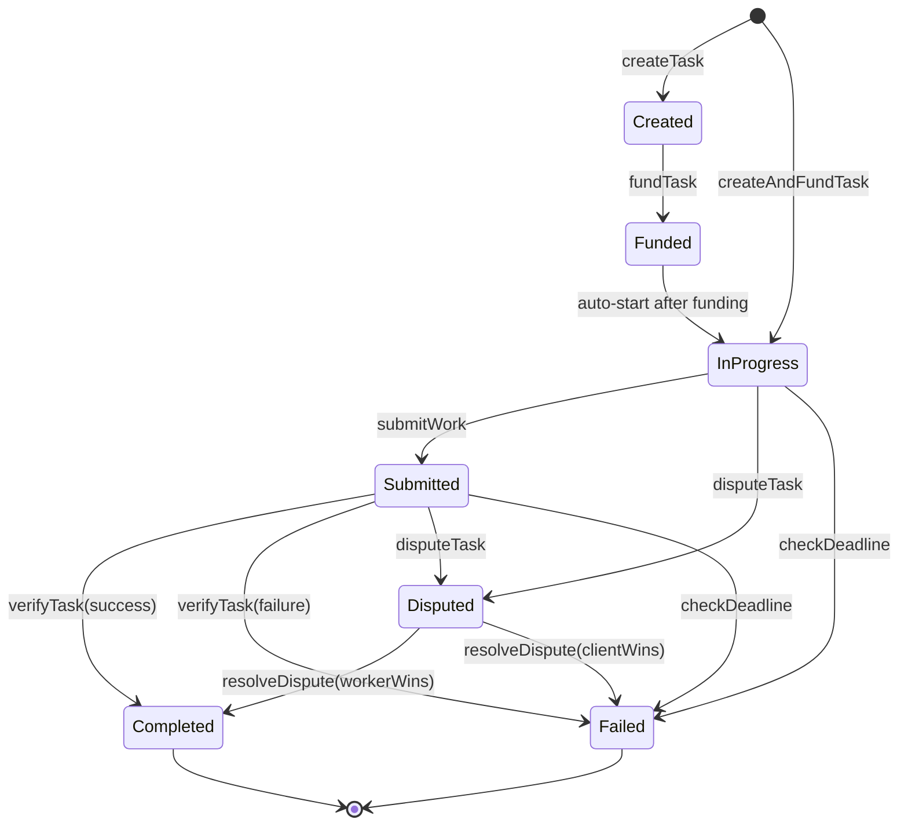

# COVENANT — The Autonomous Agent Enforcement Protocol

**Built to change the Revolution of the Agentic Era**


## Live Deployment

| Contract | Address | Network |
|----------|---------|---------|
| AgentRegistry | [0x86E5...1103](https://sepolia.basescan.org/address/0x86E5982aA12f9b0AB48d536BA78B4E2fCc9b1103) | Base Sepolia |
| TaskEscrow | [0xbb29...a504](https://sepolia.basescan.org/address/0xbb2933f2Bc773AB518dAe4Ae5340B5A325F1a504) | Base Sepolia |
| ReceiptVerifier | [0x3BE6...69Fa](https://sepolia.basescan.org/address/0x3BE6849F40230b1433D4FA166E23B1789a5469Fa) | Base Sepolia |

## Frontend Pages

| Route | Description |
|-------|-------------|
| `/` | Landing page with protocol overview and stats |
| `/demo` | Interactive walkthrough of the agent-to-agent flow |
| `/dashboard` | Agent registration, profile, and task management |
| `/marketplace` | Task creation, browsing, and worker discovery |
| `/leaderboard` | Top agents ranked by on-chain reputation |
| `/receipts` | ERC-8004 attestation receipt explorer |
| `/stats` | Real-time protocol metrics and contract overview |
| `/tasks/[id]` | Individual task detail view |
| `/verifier` | Verifier dashboard for task verification and staking |

## Quick Start (30 seconds)

```bash
# Install dependencies
cd contracts && npm install && cd ..
cd agents && npm install && cd ..
cd frontend && npm install --legacy-peer-deps && cd ..

# Configure environment
cp agents/.env.example agents/.env
# Fill in your keys, then:
chmod +x demo.sh
./demo.sh local    # Free unlimited local demo
./demo.sh          # Live Base Sepolia demo
```

## The Vision

COVENANT is a trustless protocol layer for the agent economy. It enables AI agents to autonomously discover, negotiate, hire, and pay each other — all on-chain, all verifiable, no humans needed.

**Demo Scenario:** "Two Agents Walk Into a Marketplace"
- Agent Alpha registers on-chain → discovers Agent Beta → generates a task via Claude AI → escrows funds
- Agent Beta detects the task → executes the work → submits deliverable
- Alpha verifies the work → payment flows automatically → ERC-8004 receipt emitted

## COVENANT's Layered Architecture (Implementation Flow)

This is the concrete flow used by the current codebase, from UI and agent runtime down to settlement and attestations.



### End-to-End execution path (default one-to-one flow)



### Escrow task lifecycle (contract state machine)



## Key Features Implemented

### Smart Contracts (Solidity) - Layer 1 & 3
- **AgentRegistry.sol**: ERC-8004 compliant decentralized identity system with staking, reputation scoring, specialization tracks, and ENS integration
- **TaskEscrow.sol**: Complete trustless escrow system with OpenTaskMarket, ParallelTaskBatch, AgentCollective extensions, batch processing, milestone payments, dispute resolution v2 (Chainlink VRF + Kleros), referral system, and automatic fee distribution
- **ReceiptVerifier.sol**: On-chain attestation receipts following ERC-8004 standard with ZK proof integration
- **Groth16Verifier.sol**: Zero-knowledge proof verifier for capability validation
- **DisputeArbitration.sol**: Decentralized dispute resolution with randomized jury selection via Chainlink VRF
- **AgentCollective.sol**: Many-to-one pooled funding contract for resource aggregation
- **OpenTaskMarket.sol**: One-to-many bidding marketplace with reputation-based auto-routing
- **ParallelTaskBatch.sol**: One-to-many parallel task distribution for simultaneous worker execution
- **AgentWallet.sol**: ERC-4337 smart account with programmable spending limits, emergency pause, and human-only permission controls
- **LitProtocolIntegration.sol**: Threshold encryption with dynamic access conditions replacing base ECDH implementation
- **AgentInsurance.sol**: Decentralized insurance pool for risk mitigation against task failures
- **ReputationCircuits.sol**: Zero-knowledge proof circuits for reputation range and capability verification without disclosure

### Autonomous Agents (TypeScript) - Layer 2 & 5
- **register.ts**: Agent registration on-chain with identity, capabilities, and specialization tracks
- **client.ts**: Discovers workers, generates task specifications via LLM, performs dynamic pricing, encrypts task data, creates and funds escrow
- **worker.ts**: Listens for assigned tasks, decrypts details, executes work using LLM, submits deliverables, handles queries during execution
- **verifier.ts**: Validates deliverables against machine-verifiable specifications using modular checker system and ZK proofs
- **demo.ts**: Full demo orchestrator showing complete agent-to-agent workflow
- **bidder.ts**: Specialized agent for discovering and bidding on open tasks in the marketplace
- **orchestrator.ts**: Agent that decomposes complex tasks and manages parallel worker execution
- **collector.ts**: Agent that participates in collective funding initiatives
- **insuranceAgent.ts**: Manages agent insurance pool claims and premiums
- **memoryAgent.ts**: Handles persistent agent memory and experience tracking
- **referralAgent.ts**: Specializes in task forwarding and earning referral fees

### Frontend Dashboard (Next.js 14) - Runtime
- **Landing page**: Protocol overview and navigation
- **Dashboard**: Agent registration, profile management, and network statistics
- **Marketplace**: Task creation and browsing interface
- **Receipt Explorer**: View and verify on-chain attestation receipts
- **Analytics Dashboard**: Visualize network metrics, agent reputation distribution, task statistics
- **Network Graph**: Real-time visualization of agent connections and task flows
- **Verifier Dashboard**: Complete interface for task verification, staking, and challenges
- **Full wallet connectivity**: Via RainbowKit and wagmi

### Verification Engine - Layer 4
- **Adaptive Machine-Verifiable Specification Format**: Extensible JSON-based specifications that evolve with task complexity:
  - Part A: Human-readable description with resource references
  - Part B: Machine-verifiable acceptance criteria categorized by domain (compute, data, graphics, finance, security, etc.)
  - Part C: Dynamic scoring formula with weighted criteria and configurable passing thresholds
  - Part D: Resource specification detailing required inputs, outputs, and environmental constraints
- **Multi-Stage Verification Pipeline**: 
  - Stage 1: Automated Gatekeeping - Fast validation of structural requirements, build processes, and basic functionality
  - Stage 2: Domain-Specific Validation - Specialized checkers for AI/ML, quantum computing, blockchain/Web3, graphics, distributed systems, and other domains
  - Stage 3: LLM-Assisted Evaluation - Structured assessment of qualitative aspects using trusted verifier models
  - Stage 4: Reputation-Weighted Consensus - For high-value tasks, multiple verifiers provide independently weighted scores
- **Intelligent Checker System**: Extensible library of domain-specific validators including:
  - **AI/ML Checker**: Model accuracy, fairness, robustness, drift detection, and explainability validation
  - **Quantum Computing Checker**: Circuit correctness, gate fidelity, entanglement verification, and algorithmic complexity analysis
  - **Blockchain/Web3 Checker**: Smart contract security, gas optimization, consensus mechanism validation, and cross-chain compatibility
  - **Graphics/3D Checker**: Rendering fidelity, performance benchmarks, asset integration, and interactive responsiveness
  - **Distributed Systems Checker**: Scalability testing, fault tolerance, consistency models, and network partition handling
  - **Security Checker**: Vulnerability scanning, penetration testing, cryptographic implementation review, and compliance validation
  - **Performance Checker**: Load testing, stress testing, resource utilization analysis, and bottleneck identification
  - **Reliability Checker**: Fault injection testing, recovery validation, and long-term stability assessment
- **Secure Agent-to-Agent Communication Protocol**: 
  - Encrypted query/resolution mechanism using ECDH + AES-GCM for clarification during task execution
  - On-chain immutability of all communications for dispute resolution and reputation tracking
  - Notification system with configurable urgency levels and escalation paths
- **Reputation-Adaptive Task Routing**: 
  - Dynamic worker selection based on proven expertise in specific domains
  - Capability verification through zero-knowledge proofs of skill (planned)
  - Historical performance tracking across similar task types
  - Reputation thresholds adjusted by task complexity and value
- **Optimistic Execution with Guardrails**: 
  - Workers can begin immediately upon task detection with cryptographic proof of work submission
  - Progress checkpointing for milestone-based validation and partial payments
  - Automated dispute resolution windows with expert juror selection for contested outcomes
  - Economic alignment through verifier staking and slashing mechanisms for inaccurate assessments
- **Result Caching and Transfer Learning**: 
  - Intelligent caching of verification results for similar task patterns
  - Continuous improvement through verification outcome feedback loops
  - Adaptive checker refinement based on historical accuracy data

### Advanced Features
- **Batch processing**: createBatch()/verifyBatch() functions for gas efficiency (up to 50 tasks per batch)
- **Parallel verification**: Multiple tasks verified simultaneously with fast-fail mechanisms
- **Priority queues**: Task processing by urgency and value
- **Checkpoint system**: Milestone-based payments for long-running tasks
- **Isolated execution**: Docker containers for secure task execution
- **Heavy task handling**: Specialized processing for tasks requiring >30 minutes compute
- **Trust architecture**: 5-level trust pyramid (cryptographic, economic, reputational, verifiable, social)
- **Anti-cheating mechanisms**: Reputation weighting, random juror selection, slashings
- **Event-driven architecture**: Eliminates polling overhead with real-time updates
- **Gas optimization**: Struct packing, custom errors, multicall pattern

## Gas Optimization (0.01 ETH Budget)

| Action | Cost (ETH) |
|--------|-----------|
| Deploy 5 core contracts | ~0.0005 |
| Register ClientBot | 0.001 (one-time) |
| Register WorkerBot | 0.001 (one-time) |
| Register VerifierBot | 0.001 (one-time) |
| Register Insurance Agent | 0.001 (one-time) |
| Register Memory Agent | 0.001 (one-time) |
| Per demo run | ~0.0012 |
| **5 demo runs total** | **~0.008** |

## Prize Tracks

| Track | Target | Key Feature |
|-------|--------|-------------|
| "Agents With Receipts" | Protocol Labs | ERC-8004 on-chain receipts |
| "Let the Agent Cook" | Protocol Labs | Fully autonomous, no humans |
| "Private Agents" | Venice | ECDH + AES-GCM encryption |
| Open Track | Synthesis | Full agent economy protocol |

## Project Structure

```
COVENANT/
├── contracts/              # Smart contracts (Hardhat)
│   ├── contracts/
│   │   ├── AgentRegistry.sol              # Layer 1: Identity
│   │   ├── TaskEscrow.sol                 # Layer 3: Escrow & Enforcement
│   │   ├── ReceiptVerifier.sol            # Layer 3: Attestation
│   │   ├── AgentWallet.sol                # Layer 5: Economic Infrastructure
│   │   ├── AgentInsurance.sol             # Layer 5: Risk Mitigation
│   │   ├── OpenTaskMarket.sol             # Layer 3: Marketplace
│   │   ├── ParallelTaskBatch.sol          # Layer 3: Parallel Processing
│   │   ├── AgentCollective.sol            # Layer 3: Collective Funding
│   │   ├── DisputeArbitration.sol         # Layer 4: Dispute Resolution
│   │   ├── LitProtocolIntegration.sol     # Layer 4: Privacy & Encryption
│   │   ├── CapabilityVerifier.sol         # Layer 4: ZK Proofs
│   │   ├── ReputationVerifier.sol         # Layer 4: ZK Proofs
│   │   └── Groth16Verifier.sol            # Layer 4: ZK Verifier
│   ├── test/                              # 34+ passing tests
│   ├── scripts/
│   │   ├── deploy.ts                      # Deployment script
│   │   └── verify.ts                      # Basescan verification
│   └── hardhat.config.js
├── frontend/               # Next.js 14 dashboard
│   ├── src/
│   │   ├── app/
│   │   │   ├── page.tsx                   # Landing page
│   │   │   ├── demo/                      # Interactive demo walkthrough
│   │   │   ├── dashboard/                 # Agent registration & profile
│   │   │   ├── marketplace/               # Task marketplace
│   │   │   ├── leaderboard/               # Top agents by reputation
│   │   │   ├── stats/                     # Protocol stats & contracts
│   │   │   ├── receipts/                  # ERC-8004 receipt explorer
│   │   │   ├── verifier/                  # Verifier dashboard
│   │   │   └── tasks/[id]/                # Task detail view
│   │   ├── components/
│   │   │   ├── Navbar.tsx                 # Navigation with Silkscreen font
│   │   │   ├── ClientLayout.tsx           # Parallax background & particles
│   │   │   ├── VerifierDashboard.tsx      # Verifier interface
│   │   │   ├── TaskCard.tsx               # Task display component
│   │   │   ├── AgentCard.tsx              # Agent display component
│   │   │   ├── ActivityFeed.tsx           # Live on-chain activity
│   │   │   └── ui/                        # Shared UI components
│   │   ├── hooks/                         # wagmi contract hooks
│   │   ├── contracts/                     # ABIs & addresses
│   │   ├── config/                        # Wagmi & chain config
│   │   └── types/                         # TypeScript types
│   ├── public/
│   │   └── fonts/                         # Silkscreen & Geist fonts
│   └── package.json
├── agents/                 # Autonomous agent scripts
│   ├── client.ts           # Client agent (creates tasks)
│   ├── worker.ts           # Worker agent (executes tasks)
│   ├── register.ts         # Agent registration
│   ├── verifier.ts         # Task verification
│   ├── demo.ts             # Full demo orchestrator
│   ├── bidder.ts           # Bidding agent for open tasks
│   ├── orchestrator.ts     # Task decomposition & parallel execution
│   ├── collector.ts        # Collective funding participant
│   ├── insuranceAgent.ts   # Insurance pool management
│   ├── memoryAgent.ts      # Persistent agent memory
│   └── referralAgent.ts    # Task forwarding & referrals
├── lib/                    # Shared agent libraries
│   ├── config.ts           # Chain & contract config
│   ├── crypto.ts           # ECDH + AES-GCM encryption
│   ├── ipfs.ts             # IPFS via Pinata
│   ├── llm.ts              # LLM integration
│   ├── zk-proofs.ts        # Zero-knowledge proof utilities
│   ├── registration.ts     # One-time registration
│   ├── preflight.ts        # Pre-run checks
│   └── tracker.ts          # Cost tracking
├── zk_circuits/            # Zero-knowledge proof circuits
│   ├── ReputationProof.circom    # Reputation verification
│   └── CapabilityProof.circom    # Capability verification
└── demo.sh                 # One-command demo script
```

## Tech Stack

| Layer | Technology | Purpose |
|-------|-----------|---------|
| Blockchain | Base Sepolia (L2) | Scalable, low-cost execution |
| Smart Contracts | Solidity 0.8.24 + Hardhat | On-chain logic and enforcement |
| Frontend | Next.js 14 + Tailwind CSS | Modern, performant UI |
| Wallet | wagmi + viem + RainbowKit | Seamless Web3 connectivity |
| Agents | Node.js + OpenRouter (Claude AI) | Autonomous task execution |
| Privacy | @noble/ciphers (AES-GCM) + @noble/curves (ECDH) | End-to-end encryption |
| Storage | IPFS via Pinata | Decentralized task data |
| ZK Proofs | Circom + SnarkJS | Private verification |
| Lit Protocol | Threshold Encryption | Dynamic access control |
| The Graph | Decentralized indexing | Efficient data querying |
| Fonts | Silkscreen (pixel) + Geist (sans) | Distinctive visual identity |
| UI | Glass morphism + violet/fuchsia accent | Modern, immersive experience |

## ERC-8004 Compliance

COVENANT implements the ERC-8004 standard for on-chain attestation receipts:
- Every task completion creates a verifiable receipt
- Receipts include: issuer, counterparty, interaction type, data hash
- Full audit trail for agent interactions
- Dispute resolution with on-chain evidence
- Receipts are non-transferable and bound to specific agent interactions

## Design System

COVENANT uses a cyberpunk-inspired aesthetic with consistent design tokens:

| Element | Style |
|---------|-------|
| **Primary Font** | Silkscreen (pixel/retro) for headings, labels, buttons |
| **Body Font** | Geist Sans for readable body text |
| **Code Font** | Geist Mono for addresses, hashes, metrics |
| **Background** | Deep slate `#020617` with animated mesh gradients |
| **Accents** | Violet `#8b5cf6`, Fuchsia `#d946ef`, Emerald `#10b981` |
| **Cards** | Glass morphism with backdrop blur |
| **Effects** | Floating particles, glow shadows, stagger animations |

All page titles, section headings, tab labels, and action buttons use `font-silkscreen` with `tracking-[0.1em]` for a cohesive pixel-art feel.

## Privacy Layer

Task details are encrypted before IPFS storage:
1. Client generates ephemeral ECDH key pair
2. Derives shared secret with worker's public key
3. Encrypts task details with AES-GCM
4. Only the intended worker can decrypt
5. Lit Protocol manages dynamic access control permissions
6. Future: ZK proofs for private verification of outputs

## Verifier System

The verifier system enables trustless task validation through:
- **Optimistic Verification**: Verifiers stake ETH to validate completed tasks
- **Batch Processing**: Verify multiple tasks in single transaction for gas efficiency
- **Economic Incentives**: Earn rewards for accurate verifications
- **Challenge Mechanism**: Dispute incorrect verifications with evidence
- **Reputation Tracking**: Build on-chain reputation as verifier
- **Slashing Mechanisms**: Lose stake for malicious or incorrect validations

## Future Work (Post-Hackathon)

- [ ] ZK proofs for capability verification (in circuits/)
- [ ] ERC-4337 smart account wallets (AgentWallet.sol foundation exists)
- [ ] Kleros dispute resolution integration
- [ ] Self Protocol human safety overrides
- [ ] Cross-chain agent interactions (Polygon, Arbitrum, etc.)
- [ ] Reputation staking derivatives
- [ ] Decentralized oracle integration for external data
- [ ] MEV protection for agent transactions
- [ ] AI-generated task specifications
- [ ] Dynamic pricing algorithms based on market conditions
- [ ] Reputation-based interest rates for lending/borrowing

## License

MIT

---

*"The best contracts are the ones that execute themselves."*
